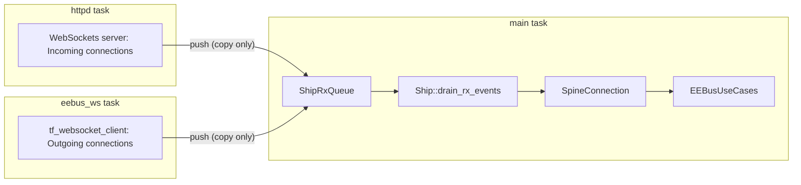

# EEBUS Module

This document decribes the basic pointer lifetime, data flow and connection
rules that the code follows.

## Lifetime rules

- `ShipPeerHandler::peers` is the **sole owner** of every `ShipNode`. All other
  `ShipNode` pointers (`ShipConnection::peer_node`, locals) are non-owning.
- A node may only be erased via the tombstone flow , which guarantees no
  connection references it anymore.
- **Never capture a `ShipNode*` (or `ShipConnection*`) in a delayed task-scheduler
  lambda.** Capture the SKI and re-resolve with `get_peer_by_ski()` when the lambda
  runs. A `nullptr` result means the peer was removed in the meantime.
- A `SpineConnection` lives inside its `ShipConnection` and dies with it. Use-case
  code must look up connections per message via `EEBusUseCases::get_spine_connection()`.

## Tasks and data flow

Everything runs on the **main task**, except the websocket receive paths. Those only
copy data and push events. `ShipRxQueue` is the single cross-task synchronization
point of the module.

## Connection roles and identity

- The **SKI** from the TLS client certificate is the only peer identity.
- Server role: Peer connects to our websocket server. The connection is keyed by
  the socket fd and runs on the shared `httpd` task.
- Client role: We dial out to peers (`connect_trusted_peers`). Each
  connection has its own `eebus_ws` task owned by `tf_websocket_client`.
